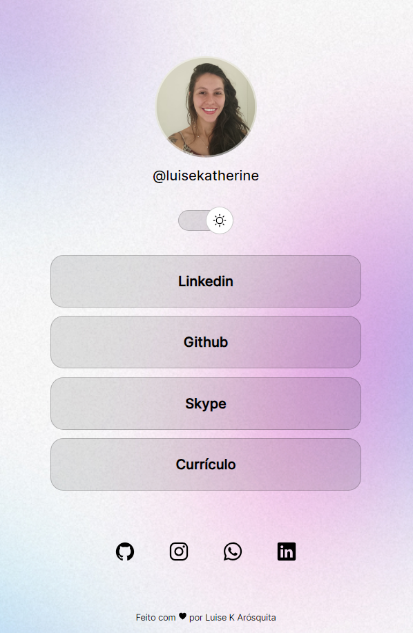

<h1>Projeto desenvolvido com base nos ensinamentos do professor Mayk, da Rocketeat, com as seguintes tecnologias:</h1>
<ul>
  <li>Figma</li>
  <li>HTML e CSS</li>
  <li>Javascript</li>
  <li>Git e Github</li>
</ul>

  
  

#Rocketseat #HTML #CSS #Javascript #Figma